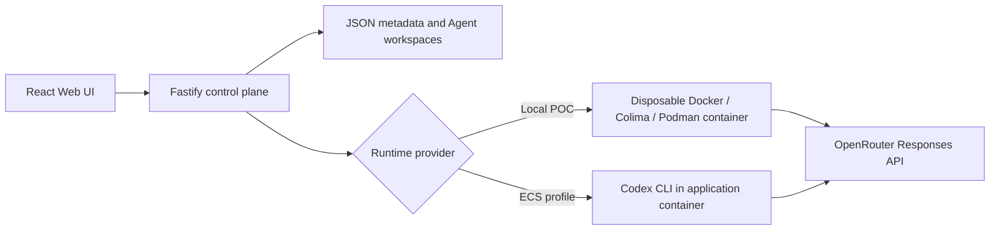

# Volc Agent Launchpad

A minimal Agent platform for three-day middleware hackathons. It provides Agent
CRUD, a browser Playground, persistent workspaces, and Codex CLI backed by
OpenRouter's OpenAI-compatible Responses API.

Run it locally with Docker, Colima, or rootless Podman, or deploy it to
Volcengine ECS.

> [!WARNING]
> This is a single-user proof of concept. It intentionally has no identity or
> hardened sandbox middleware. Do not use production data or credentials. See
> [SECURITY.md](SECURITY.md).

**Selected track: Glass Box (trace and audit)**, extended with a lifecycle
reconciliation / failure-recovery capability — see
[Middleware](#middleware-run-reliability--observability) below.

## Screenshots

### Agent Playground


### Create an Agent


## Features

- React and TypeScript Web UI
- Agent create, edit, start, stop, delete, and multi-turn chat
- Fastify control plane with asynchronous Run state
- Persistent Agent workspaces and Codex sessions
- Disposable Docker, Colima, or Podman container for each local turn
- Docker and Terraform deployment paths for Volcengine ECS

## Middleware: Run Reliability & Observability

**Problem:** a Run's progress (a discovered Codex thread, streamed output)
lived only in transient, in-process memory until it finished naturally. Any
interruption — a server restart, an explicit Stop, a dropped client
connection — was treated as total data loss dressed up as a status
transition, rather than something to reconcile or make visible.

**What was added, and where it lives:**

- `apps/server/src/middleware/observability-runner.ts` — `ObservabilityRunner`
  wraps the `AgentRunner` interface (the seam this repo already calls out as
  "the place for runtime-specific behavior") and mirrors every Run's
  lifecycle into a redacted, append-only, per-Run trace
  (`middleware/trace-store.ts`), without `AgentService` (the Control Plane)
  knowing tracing exists at all. `GET /api/runs/:id/trace` exposes it; the
  Playground has a "View trace" toggle.
- `AgentService.initialize()` now **reconciles** any Run left
  `queued`/`running` after a restart instead of blind-cancelling it: a
  still-running local container is reattached (`docker logs -f`) instead of
  being declared dead, and whatever thread id / partial output was already
  checkpointed survives either way — including across an explicit Stop, so
  the next message resumes the same Codex thread instead of starting fresh.

**Boundary, data flow, and design rationale:** [`docs/ARCHITECTURE.md#middleware`](docs/ARCHITECTURE.md#middleware)
for the short version; [`docs/reliability/`](docs/reliability/README.md) for
the full root-cause analysis and per-capability design docs.

**Demo it yourself:**

1. Send a Playground prompt, click **Stop** mid-turn, then send a follow-up
   message — Codex still has context from the interrupted turn. Open **View
   trace** to see the `cancelled` event next to the `thread_started` event
   it preserved.
2. Under `RUNTIME_PROVIDER=container`, start a Run, kill the server process
   while it's `running`, and restart it: the Run either finishes (its
   container was reattached) or lands `cancelled` with its last
   checkpointed output intact — never a blank slate.

**Automated verification:** `apps/server/src/middleware/observability-runner.test.ts`
and the "Run interruption and recovery" cases in `agent-service.test.ts`
cover both the normal and interrupted paths.

**Known limitations:** the container-reattachment path is covered by unit
tests against a mocked runner, not yet exercised against a live
Docker/Colima/Podman daemon; local-process (`RUNTIME_PROVIDER=local-process`)
Runs cannot be reattached after a hard crash, only checkpointed-and-preserved
(a stated ceiling of that profile, not a bug). Full status, what's verified
vs. not, and what to do next: [`docs/reliability/README.md`](docs/reliability/README.md).

## Requirements

- Node.js 22+
- npm 10+
- Docker, Colima, or Podman
- An [OpenRouter](https://openrouter.ai/) API key and a model slug (e.g. `openai/gpt-4o-mini`)

Codex CLI is included in the Runtime image and is not required on the host.

## Local browser SOP

### 1. Check the local tools

Install Node.js 22+ and one supported container engine, then verify them:

```bash
node --version
npm --version
docker --version        # Docker Desktop, Docker Engine, or Colima
podman --version        # Use this instead when running Podman
```

Only one container engine is required. Codex CLI is already included in the
Runtime image.

### 2. Clone the repository

```bash
git clone <repository-url> volc-agent-launchpad
cd volc-agent-launchpad
```

Skip this step when already working from the repository root.

### 3. Start the POC

```bash
OPENROUTER_API_KEY=your-openrouter-api-key \
OPENROUTER_MODEL=openai/gpt-4o-mini \
npm run poc
```

The first run installs Node.js dependencies and builds the Runtime image. The
script automatically selects Docker, Colima, or Podman.

### 4. Open the browser

Visit <http://localhost:3000>, or open it from the terminal:

```bash
open http://localhost:3000       # macOS
xdg-open http://localhost:3000   # Linux desktop
```

In the Web UI:

1. Select **Create Agent**.
2. Enter a name, description, and workspace instructions.
3. Select **Create Agent** again.
4. Enter a task in the Playground, for example:

   ```text
   Create a TypeScript hello-world CLI, add a test, and run it.
   ```

The Agent can write files, run commands, and continue the same Codex session in
later messages.

### 5. Stop and resume

Press `Ctrl+C` in the startup terminal. The script removes temporary Runtime
containers but keeps Agent workspaces and conversations.

- macOS state: `~/.volc-agent-launchpad/`
- Linux state: `.local/`
- Custom location: set `LOCAL_POC_DATA_ROOT`

Run the same `npm run poc` command to continue later.

### Select a specific container engine

Force Podman when multiple engines are installed:

```bash
CONTAINER_ENGINE=podman \
OPENROUTER_API_KEY=your-openrouter-api-key \
OPENROUTER_MODEL=openai/gpt-4o-mini \
npm run poc
```

Colima uses `CONTAINER_ENGINE=docker` because it exposes the Docker CLI.

For a clean Linux host, follow the
[rootless Podman setup](docs/LOCAL_POC.md#rootless-podman-on-linux).

## Docker Compose

Create and edit the configuration:

```bash
./scripts/bootstrap-local.sh
```

Required values in `.env`:

```dotenv
OPENROUTER_API_KEY=your-openrouter-api-key
OPENROUTER_MODEL=openai/gpt-4o-mini
APP_AUTH_TOKEN=replace-with-at-least-24-random-characters
```

Start the application:

```bash
docker compose up --build
```

Open <http://localhost:3000>. Stop it without deleting Agent data:

```bash
docker compose down
```

## Development

```bash
npm install
cp .env.example .env
npm install --global @openai/codex@0.111.0
npm run dev
```

- Web UI: <http://localhost:5173>
- API: <http://localhost:3000>

Use local paths in `.env` when running outside Docker:

```dotenv
APP_DATA_DIR=.data
AGENT_WORKSPACE_ROOT=workspaces
CODEX_HOME=codex-home
```

## Deployment

- [Existing Linux ECS with Docker](docs/DEPLOYMENT.md#existing-linux-ecs)
- [Complete Volcengine environment with Terraform](docs/DEPLOYMENT.md#terraform-deployment)
- [Local Docker, Colima, and Podman details](docs/LOCAL_POC.md)

The existing-ECS script deploys from the current source tree:

```bash
cp .env.example .env.production
./scripts/deploy-existing-ecs.sh .env.production
```

The Terraform path provisions VPC, subnet, security group, ECS, and EIP:

```bash
cp deploy/volcengine/terraform.tfvars.example \
  deploy/volcengine/terraform.tfvars
./scripts/deploy-volcengine.sh
```

## Configuration

| Variable | Default | Purpose |
| --- | --- | --- |
| `OPENROUTER_API_KEY` | Required | OpenRouter API key. |
| `OPENROUTER_MODEL` | Required | Full OpenRouter model slug, e.g. `openai/gpt-4o-mini`. |
| `OPENROUTER_BASE_URL` | `https://openrouter.ai/api/v1` | OpenRouter's OpenAI-compatible API URL. |
| `APP_AUTH_TOKEN` | Empty on loopback | Shared demo token; use 24+ random characters remotely. |
| `RUNTIME_PROVIDER` | `local-process` | `container` for disposable local Runtime containers. |
| `CODEX_SANDBOX_MODE` | `workspace-write` | Codex inner sandbox mode. |
| `CODEX_TIMEOUT_MS` | `600000` | Maximum duration of one turn. |
| `LOCAL_POC_DATA_ROOT` | Platform-specific | Local metadata, workspace, and session directory. |

See [.env.example](.env.example) for all Runtime and resource-limit options.

## How it works



The first turn uses `codex exec`; later turns resume the stored Codex thread.
Deleting an Agent archives its workspace under `workspaces/.deleted/`.

See [docs/ARCHITECTURE.md](docs/ARCHITECTURE.md) for component and extension
boundaries.

## Validation

```bash
npm run check
terraform fmt -check -recursive deploy/volcengine
docker compose config
```

## Documentation

- [Architecture](docs/ARCHITECTURE.md)
- [Run reliability & observability middleware](docs/reliability/README.md)
- [Access control middleware](docs/ACCESS_CONTROL.md) — identity, ownership, Grants, per-Agent runtime policy
- [Local POC](docs/LOCAL_POC.md)
- [Deployment](docs/DEPLOYMENT.md)
- [Hackathon extension guide](docs/HACKATHON_EXTENSION_GUIDE.md)
- [Security policy](SECURITY.md)
- [Contributing](CONTRIBUTING.md)

## License

[MIT](LICENSE)
