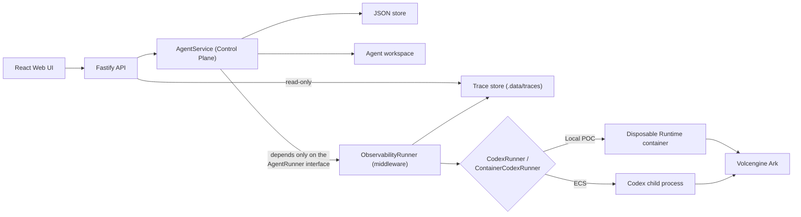

# Architecture

Volc Agent Launchpad is a single-node control plane for hackathon use. A
team-designed **Observability middleware** wraps the Agent Runtime boundary
(see [Middleware](#middleware) below) -- `AgentService` and the API layer are
unaware of it and would work identically without it.



## Components

### Web UI

Lists Agents, manages lifecycle actions, submits prompts, and polls asynchronous
Runs. It never receives the Ark API key.

### Fastify API

Validates requests, protects remote demos with a shared bearer token, and
serves the compiled Web UI. The token is not user identity or authorization.

### AgentService

Coordinates lifecycle state, persistence, workspaces, and Runs. One Agent can
have only one active Run.

```text
ready -> busy -> ready
  |       |
  v       v
stopped  error
```

On restart, `AgentService.initialize()` asks the runner to **reconcile** each
Run left `queued`/`running` rather than blindly marking it `cancelled`: if
the underlying execution survived the restart (a disposable container is not
a child process of Node, so it can outlive it), the Run is reattached and
allowed to finish normally. Otherwise it becomes `cancelled`, but any thread
id or partial output already checkpointed via the runner's progress
callbacks before the interruption is preserved rather than discarded. See
[`docs/reliability/`](./reliability/README.md) for the full design and
rationale.

### Storage

```text
data/launchpad.json       Agent, message, and Run metadata
workspaces/AgentID/       Agent-created files
workspaces/.deleted/      Archived deleted workspaces
codex-home/               Codex configuration and sessions
```

`JsonStore` serializes writes and atomically replaces one JSON file. It supports
one process only.

### Runtime providers

- `CodexRunner` runs Codex inside the application container for ECS.
- `ContainerCodexRunner` starts one disposable Docker, Colima, or Podman
  container for every local turn.

Both providers use argv-only process execution, bound output and time, resume
the stored Codex thread, and escalate termination after a grace period.

## Middleware

`apps/server/src/middleware/` holds team-designed middleware -- capabilities
layered onto the Starter Kit at a defined boundary rather than woven into
`AgentService` or the runner implementations themselves.

### Observability: `ObservabilityRunner`

Implements the same `AgentRunner` interface it wraps
(`observability-runner.ts`), so it plugs in at the seam this document already
calls a "key architectural seam": `AgentService` is constructed with
whatever `AgentRunner` `runner-factory.ts` hands it and has no way to tell
whether that runner is bare or wrapped. Composition happens once, in
`createRunner()`:

```ts
const trace = new TraceWriter(path.join(config.dataDirectory, "traces"));
const runner = createRunner(config, trace); // returns an ObservabilityRunner
const service = new AgentService(config, store, workspaces, runner);
```

**Boundary contract:**

| | |
| --- | --- |
| Sits between | `AgentService` and the concrete `CodexRunner` / `ContainerCodexRunner` |
| Data crossing in | The same `RunnerRequest` / `RunnerCallbacks` `AgentService` already builds -- no new inputs |
| Data crossing out | The same `RunnerResult` / thrown error / `ReconcileOutcome` `AgentService` already expects -- unchanged, just observed in transit |
| Owns | `.data/traces/<runId>.ndjson` -- an append-only, per-Run event log (`middleware/trace-store.ts`), separate from `launchpad.json` |
| On failure | A trace-write failure is swallowed inside the middleware (`safeAppend`) and can never turn a real Run success into a failure, or a real failure into a success |

The Fastify layer reads trace data through the narrow `TraceReader` interface
(`{ read(runId): Promise<RunEvent[]> }`), not the concrete writer -- `GET
/api/runs/:id/trace` asks `AgentService.getRun()` (Control Plane) whether the
Run exists, then the trace store (Observability Layer) for its events. Two
independent components, composed at the API route rather than one owning the
other.

## Deployment profiles

| Profile | Control plane | Agent execution |
| --- | --- | --- |
| Local POC | Host Node.js | Disposable local container |
| ECS | Application container | Codex process in the same container |
| Local development | Host Node.js | Host Codex process |

## Extension seams

| Track | Primary seam | Expected change |
| --- | --- | --- |
| Glass Box | `AgentRunner`, `AgentRun` | Emit and display correlated execution events -- **implemented**, see [Middleware](#middleware) above. |
| Bouncer | API routes, Agent ownership | Add identity and server-side authorization. |
| Kill Switch | `AgentRunner` | Add threat-specific policy or a stronger sandbox. |

A future Bouncer or Kill Switch implementation can follow the same pattern:
a new `AgentRunner`-wrapping (or Fastify-hook-based) middleware under
`apps/server/src/middleware/`, composed in `runner-factory.ts` or `app.ts`,
never edited into `AgentService` directly.

The current container or ECS instance is the POC trust boundary. Ordinary
containers are not hardened multi-tenant isolation.
